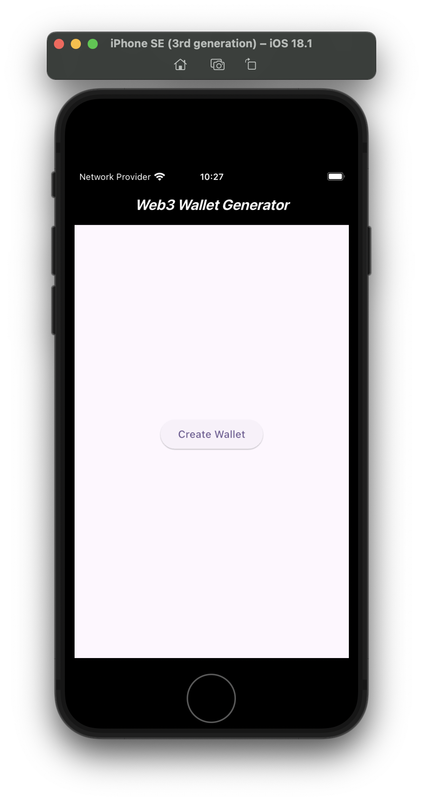
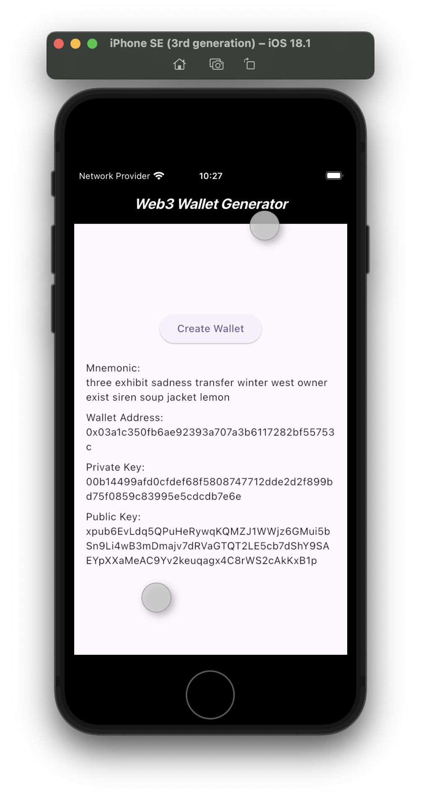

# Web3 Wallet Example in Flutter

This Flutter app demonstrates how to generate a Web3 wallet using the `web3dart` package for wallet generation and the `bip39` package for mnemonic phrase generation. It enables users to generate a wallet and view its mnemonic phrase, private key, public key, and wallet address.

## Screenshots 📸





## Introduction to Web3 and Wallets

A **Web3 wallet** is a digital wallet used to store and manage cryptocurrencies and tokens, as well as to interact with decentralized applications (dApps). It uses a private key to sign transactions, while the public key is used to derive the wallet’s address.

This app:

- Generates a mnemonic phrase (seed phrase) using **BIP39**.
- Derives the private key and public key from the mnemonic.
- Generates a wallet address using the private key.

## Dependencies

The project uses the following dependencies:

- **web3dart:** A library that facilitates interactions with Ethereum, including generating Ethereum addresses, signing transactions, and interacting with smart contracts.
- **bip39:** A library used to generate mnemonic phrases (also known as seed phrases) and derive private keys from them. The mnemonic phrase is the foundation for generating a Web3 wallet and helps in recovery or backup of the wallet.
- **bip32_bip44:** A library for deriving hierarchical deterministic (HD) wallets based on the BIP32 and BIP44 standards. It allows the derivation of private keys and public keys from a seed, which is a key aspect of Web3 wallet generation.
- **logging:** A simple logging library used for debugging purposes. It helps in tracking the flow of wallet creation and provides insights if any errors occur.

## Getting Started

### Prerequisites

Ensure you have Flutter installed. You can check by running:

```sh
flutter --version
```

### Installation

```bash
git clone web3_wallet_example

cd web3_wallet_example

flutter pub get

flutter run
```

License

This project is licensed under the MIT License.
